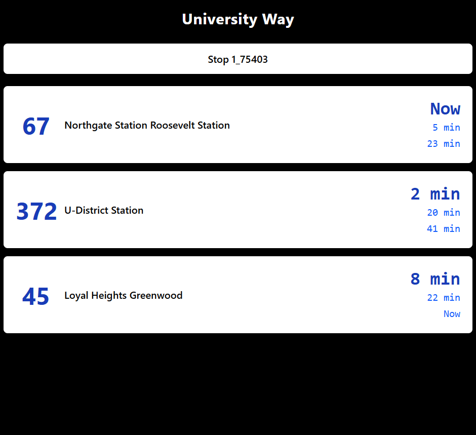

# OneBusAway Sign Mode Prototype

This is a modern, SvelteKit-based prototype for the **Next Generation Sign Mode** project proposed for Google Summer of Code with the [Open Transit Software Foundation](https://github.com/OneBusAway). It is designed to display real-time transit arrival information in a clean, full-screen interface for use on public displays such as kiosks, TVs, and station monitors.

It replicates and improves upon the legacy Sign Mode functionality from the original OneBusAway web application, offering a more modern tech stack, better configurability, and enhanced UI/UX.

---

## ✨ Features

- Display real-time arrival data for one or more stop IDs
- Configurable via URL parameters (no UI required)
- Auto-refreshes at user-defined intervals
- Grouped by route and destination
- Emphasized display of the next arriving bus
- Responsive layout with a modern design (Tailwind CSS)
- Designed for deployment to kiosk screens, TVs, or digital signage

---

## 🖼 Example

This is a live view generated by the prototype using real-time data from OneBusAway.



Visit a running version with a demo stop ID:

http://localhost:5173/?stopIds=1_75403&title=University%20Way&refresh=20

Displays all upcoming buses at stop `1_75403`, with a custom title and a refresh interval of 20 seconds.

---

## ⚙️ URL Configuration Parameters

| Parameter   | Type     | Example                                   | Description                                   |
|-------------|----------|-------------------------------------------|-----------------------------------------------|
| `stopIds`   | list     | `1_75403,1_75404`                          | Comma-separated OneBusAway stop IDs           |
| `title`     | string   | `University Way Display`                  | Optional display title                        |
| `refresh`   | integer  | `15`                                       | Auto-refresh interval in seconds              |

---

## 🧑‍💻 Developer Setup

### 1. Clone the repository
```
git clone https://github.com/YOUR_USERNAME/sign-mode-prototype.git
cd sign-mode-prototype
```
2. Install dependencies
`npm install`
3. Run the development server
`npm run dev`
Open http://localhost:5173 in your browser.

## 🧪 Testing
* Manual testing across screen sizes and multiple stop IDs
* Auto-refresh tested with various intervals
* Layout tested in landscape and portrait orientations

Planned: unit tests for config parsing and display logic

## 📦 Deployment
This app can be deployed easily to:
* Vercel
* Netlify
* Self-hosted via Docker (coming soon)

## 🗺 Roadmap
* Add dark/light theme toggle
* Offline fallback using cached data
* Configuration UI for generating display URLs
* QR code for mobile access
* Accessibility and ARIA improvements

## 📄 License
MIT License

## 🙋‍♂️ Author
David Pak
Computer Science student @ University of Washington
Built as part of a proposal for Google Summer of Code 2025 with OneBusAway
